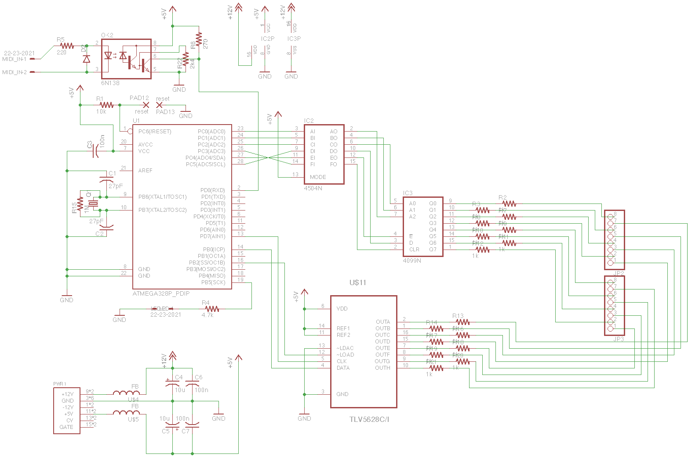
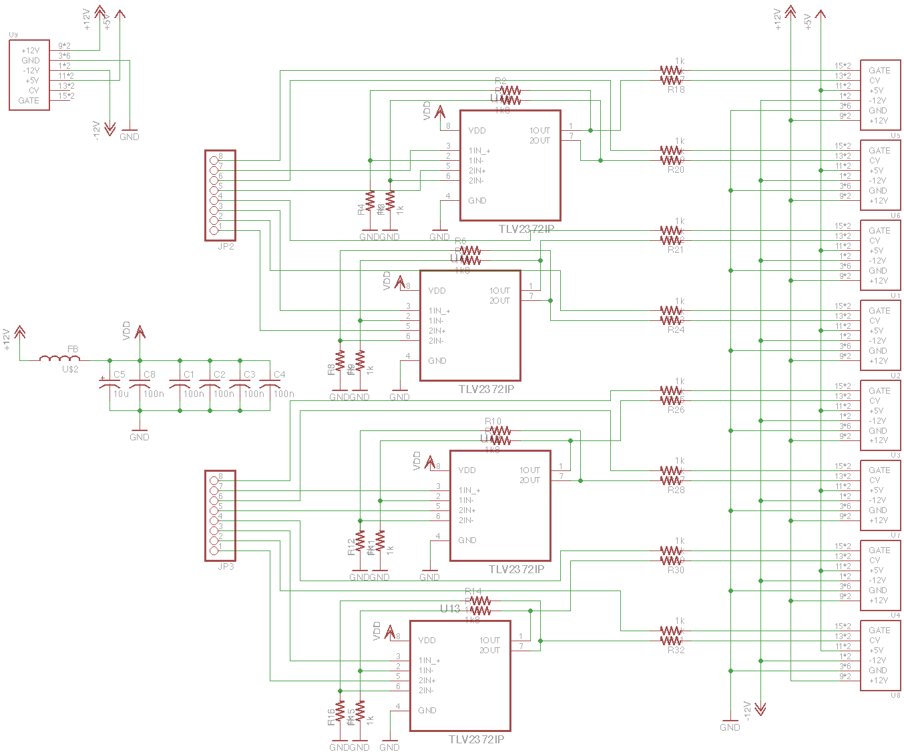

atmega_midi_cv_drums
========================

This is designed to drive drum voice circuits similar to those found in the TR-808.

A CMOS addressable latch (CD4099) generates eight trigger signals. Uses TLV5628 octal DAC to generate eight “accent” trigger signals. All signals are approximately 1ms in duration. Triggers are to the positive rail and accents are scaled by velocity of the MIDI note. Accent signals in the 808 are intended to run 4-14V, so a +/-15V supply would be appropriate here.

Euro power connectors distribute the trigger and accent signals for eight drum voices, using the “gate” and “CV” buss conventions from eurorack. The power distribution daughterboard includes four dual rail-to-rail opamps that scale the DAC output accent signals up to the intended 4-14V range (given +/-15V supply). Each power connector provides power, trigger and accent signals to the connected module.

MIDI notes start at 100 so that channel 10 can be reused without overlapping the General MIDI percussion map.

Power distribution daughterboard:

